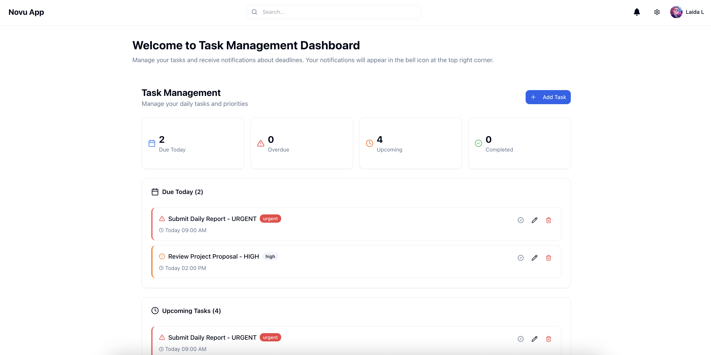

<p align="center">
   <h2 align="center">Novu Dashboard Integration App</h2>
</p>

## Novu Dashboard Integration App

Novu Dashboard Integration App demonstrates the integration of the Novu notification system with custom popup components. It showcases real-time notifications with a beautiful vignette popup overlay that displays notification details when users interact with the notification inbox.

## Features

- **Novu Inbox Integration**: Real-time notification system using Novu's React SDK
- **Custom Notification Popup**: Beautiful vignette overlay popup for displaying notification details
- **Auto-popup on Load**: Automatically displays the first notification when the application loads
- **Click-to-View**: Users can click on notifications in the inbox to view them in the popup
- **Responsive Design**: Fully responsive interface built with Tailwind CSS and shadcn/ui
- **Modern UI Components**: Clean interface using shadcn/ui component library

## Tech Stack

This application was developed using modern technologies:

- **React** - JavaScript library for building user interfaces
- **TypeScript** - Type-safe JavaScript development
- **@novu/react** - Novu React SDK for notification management
- **shadcn/ui** - Modern UI component library
- **Tailwind CSS** - Utility-first CSS framework for styling
- **Lucide React** - Beautiful icon library

## Environment Variables

Create a `.env` file in the root directory:

```env
REACT_APP_NOVU_APPLICATION_IDENTIFIER=your_novu_app_identifier
```

Get your application identifier from [Novu Dashboard](https://dashboard.novu.co/).

## Installation & Setup

Clone the project

```bash
git clone https://github.com/laidalavenia/Novu-Project.git
```

Go to the project directory

```bash
cd Novu-Project
```

Install dependencies

```bash
npm install
```

Set up environment variables

```bash
# Copy .env.example to .env and fill in your Novu credentials
cp .env.example .env
```

Start the development server

```bash
npm start
```

Build for production

```bash
npm run build
```

## Website Views

<h2 align="center">1. Notification Poup (Vignette Effect) </h2>
<p align="center">
    
</p>
<h2 align="center">2. Homepage </h2>
<p align="center">
    
</p>
<h2 align="center">3. Notification Inbox </h2>
<p align="center">
    
</p>